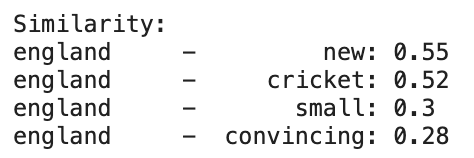
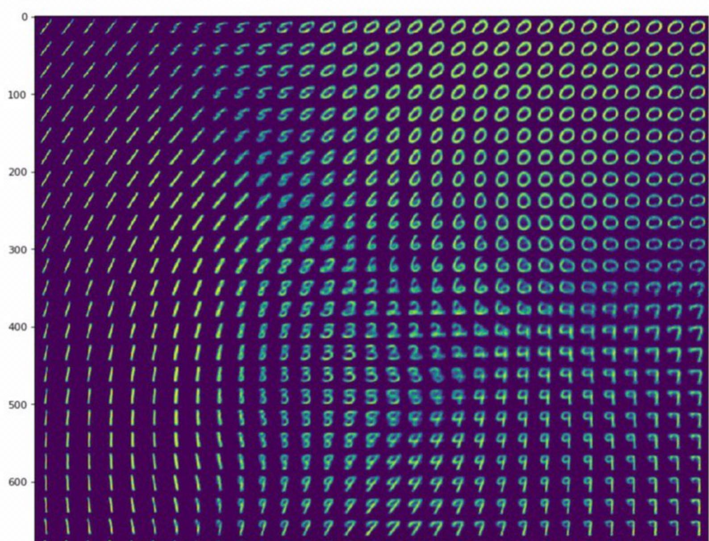

# Embedding_Experiments
Experimental codes of Embeddings, Autoencoders and Neural Network in PyTorch and Tensorflow.

## Word Embedding streaming random Wikipedia Articles

A simple word embedding model that trains on random Wikipedia article abstracts.

## Variational Autoencoder

*src/VAE_tensorflow_v1.ipynb*

Model of a simple variational autoencoder from scratch. Implemented in Tensorflow v1.

